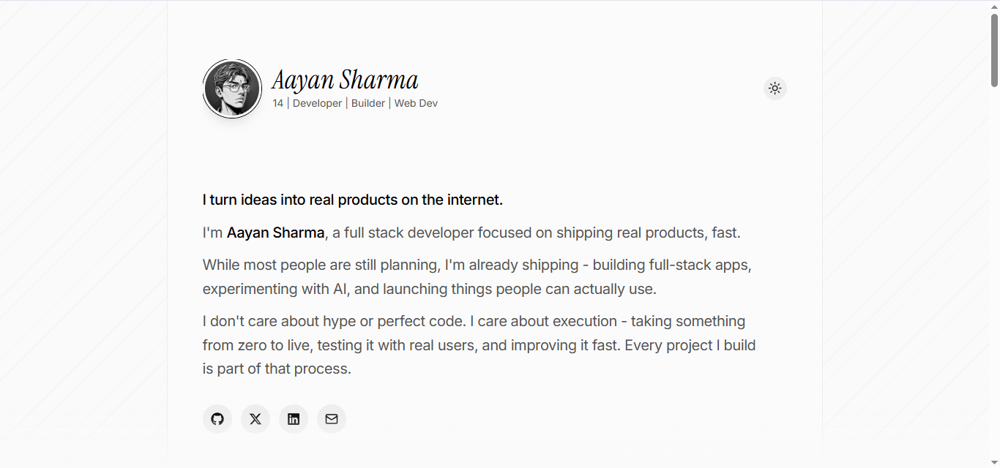
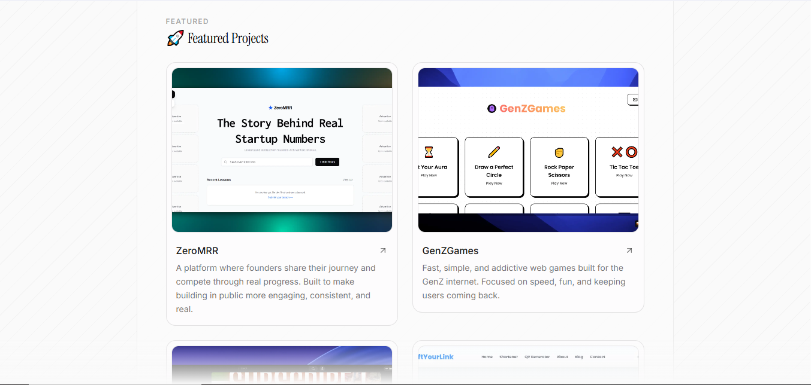
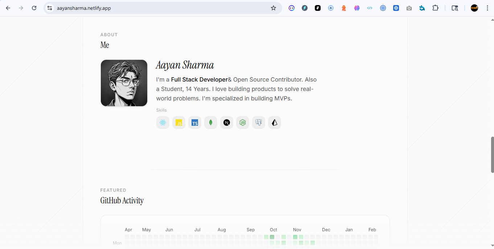
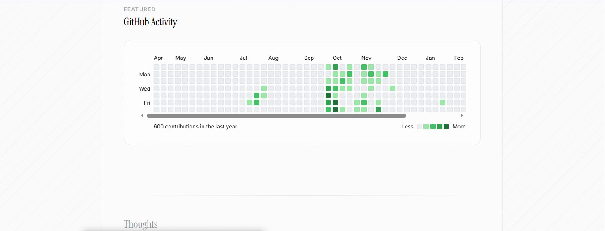
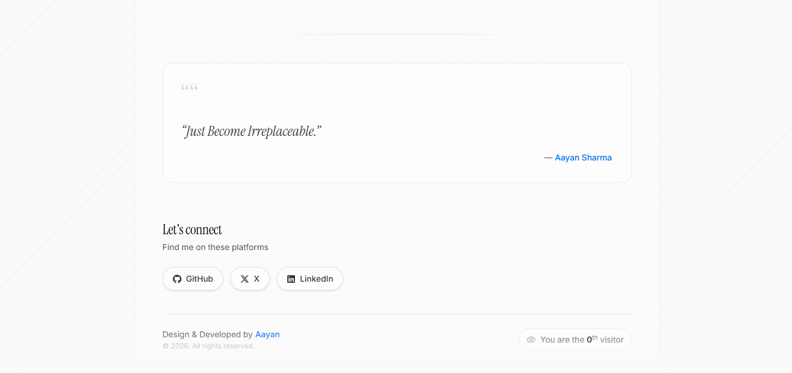

# Aayan Sharma Portfolio

**A premium, animation-rich personal portfolio built to showcase projects, personality, and proof of shipping.**

**Tech stack:** Next.js 16, React 19, TypeScript, Tailwind CSS v4, Framer Motion, next-themes

## Screenshots







## Features

- Modern one-page portfolio with clean section flow
- Smooth reveal animations and subtle premium interactions
- Light/dark theme toggle with persisted preference
- Featured projects section with visual bento-style cards
- Live GitHub contribution heatmap integration
- Visitor counter (`/api/visitors`) with browser fingerprint dedupe
- Social/contact links (GitHub, X, LinkedIn, email)
- Built-in SEO foundation with metadata, Open Graph, Twitter cards, JSON-LD, robots, sitemap, and manifest

## Why This Exists

Most portfolio templates look nice but feel generic.

This project exists to be a practical, open-source portfolio that balances strong visual identity, real project proof, fast setup, and production-ready SEO defaults.

## Setup (3 Steps)

1. **Install dependencies**
```bash
npm install
```

2. **Create `.env.local`**
```env
NEXT_PUBLIC_SITE_URL=https://your-domain.com
```

3. **Run locally**
```bash
npm run dev
```

Then open `http://localhost:3000`.

## Scripts

- `npm run dev` - start local server
- `npm run build` - production build
- `npm run start` - run production build
- `npm run lint` - run ESLint

## Contributing

PRs are welcome. If you want to improve design, performance, or developer experience, feel free to open an issue or PR.

## License

MIT - see [LICENSE](./LICENSE).
