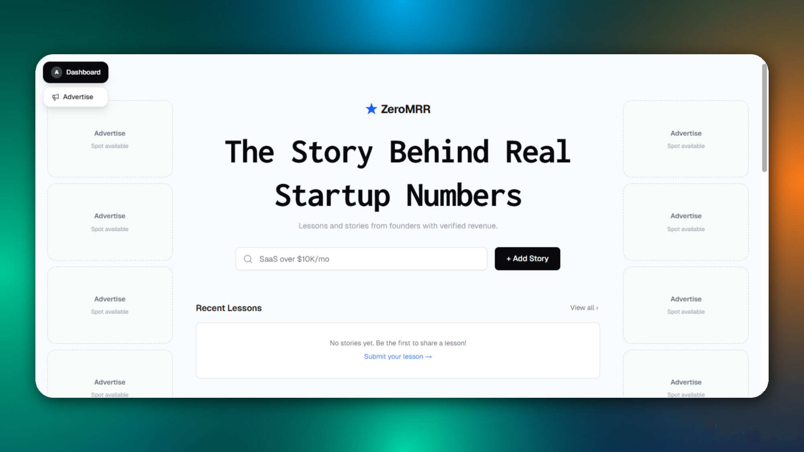
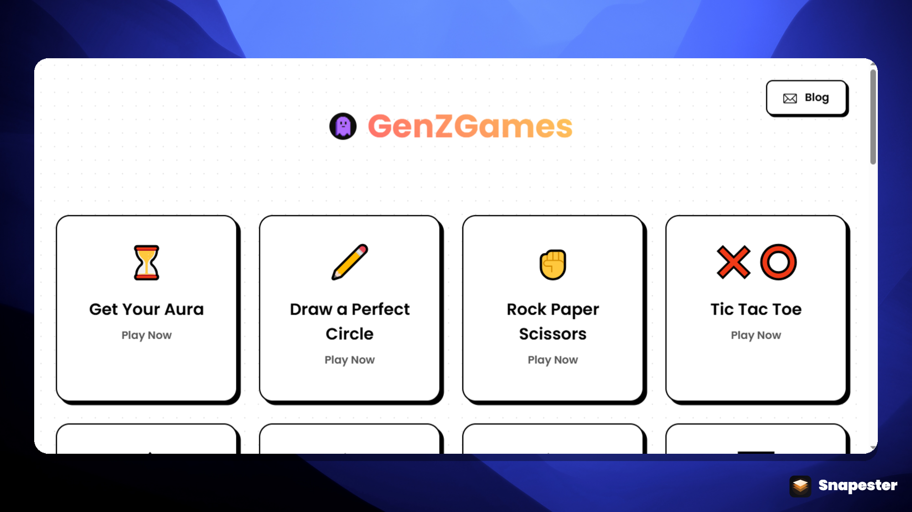
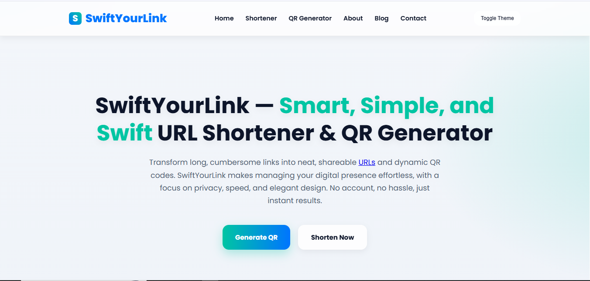

# Aayan Sharma Portfolio

**A premium, animation-rich personal portfolio built to showcase projects, personality, and proof of shipping.**

**Tech stack:** Next.js 16, React 19, TypeScript, Tailwind CSS v4, Framer Motion, next-themes

## Screenshots

<<<<<<< HEAD




=======
- (https://aayansharma.netlify.app)

## Tech Stack

- Next.js `16.2.2` (App Router)
- React `19.2.4`
- TypeScript `^5`
- Tailwind CSS `^4`
- Framer Motion
- next-themes
- ESLint (`eslint-config-next`)
>>>>>>> 6c56dd82f87842a374aa9a7f0b7c0cbe6d3d7d75

## Features

- Modern one-page portfolio with clean section flow
- Smooth reveal animations and subtle premium interactions
- Light/dark theme toggle with persisted preference
- Featured projects section with visual bento-style cards
- Live GitHub contribution heatmap integration
- Visitor counter (`/api/visitors`) with browser fingerprint dedupe
- Social/contact links (GitHub, X, LinkedIn, email)
- Built-in SEO foundation:
  - Metadata + canonical
  - Open Graph + Twitter cards
  - JSON-LD Person schema
  - `robots.txt`, `sitemap.xml`, and `manifest.webmanifest`

## Why This Exists

Most portfolio templates look nice but feel generic.

This project exists to be a practical, open-source portfolio that balances:
- strong visual identity
- real product/project proof
- fast setup and easy customization
- production-ready SEO defaults

If you want a portfolio that feels personal instead of templated, this is the base.

## Setup (3 Steps)

1. **Install dependencies**
```bash
npm install
```

2. **Create `.env.local`**
```env
NEXT_PUBLIC_SITE_URL=https://your-domain.com
```

3. **Run locally**
```bash
npm run dev
```

Then open `http://localhost:3000`.

## Scripts

- `npm run dev` - start local server
- `npm run build` - production build
- `npm run start` - run production build
- `npm run lint` - run ESLint

## Contributing

PRs are welcome. If you want to improve design, performance, or developer experience, feel free to open an issue or PR.

## License

MIT - see [LICENSE](./LICENSE).
